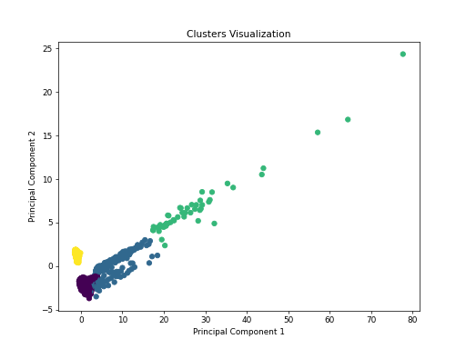

```markdown
# Goodreads Data Analysis

## Overview
This repository contains an analysis of a dataset derived from Goodreads, which details various attributes of books, including ratings, authors, publication year, and more. The dataset comprises 10,000 entries with numerous features that provide insight into the reading preferences and trends on the platform. The key features include:

- `average_rating`: The average rating of each book.
- `ratings_count`: The total number of ratings received.
- `work_text_reviews_count`: Number of text reviews written for the book.
- `ratings_1` to `ratings_5`: Breakdown of ratings from 1 to 5 stars.

The dataset allows us to perform clustering and principal component analysis (PCA), enabling us to explore patterns and relationships between various book characteristics.

## Analysis Performed
### Clustering
A clustering algorithm was applied to the dataset to group similar books based on their attributes, particularly focusing on `average_rating`, `ratings_count`, and other relevant features. The K-means algorithm was employed, and the optimal number of clusters was determined through the elbow method.

### Principal Component Analysis (PCA)
PCA was conducted to reduce the dimensionality of the dataset while retaining the most variance. This analysis helps visualize the underlying structure of the data and identify which features contribute most to the variance.

### Chi-squared Test
A Chi-squared test was performed on categorical variables to determine if there are significant associations between different features such as `authors`, `language_code`, and `titles`.

## Key Findings
1. **Clustering Results**: The clustering analysis identified distinct groups of books based on their ratings and review counts, indicating differing audience engagement levels. The 2D representation of these clusters is shown below:
   

2. **Rating Correlations**: A correlation heatmap revealed strong positive correlations between the different star ratings (e.g. ratings_4, ratings_5) and overall ratings counts, indicating that books with higher average ratings tend to receive more reviews.
   

3. **Outlier Detection**: Analysis of outliers showed that certain features exhibit significant outlier percentages, especially in `ratings_count` and `work_text_reviews_count`, emphasizing the presence of popular books that receive an unusually high number of ratings.

4. **Significant Associations**: The Chi-squared test indicated a significant association between `authors` and `language_code`, hinting at language preferences among fans of specific authors. The high p-values in other associations suggest some features are independent of each other.

## Conclusion
The data analysis of the Goodreads dataset provided valuable insights into reader preferences, book ratings, and patterns in engaging literature. The clusters formed indicate varying levels of popularity and reader engagement, while the PCA helped visualize these trends clearly. Future work could involve deeper analysis into the factors influencing high ratings and engagement, as well as the exploration of temporal trends in book reviews.

For further inquiries or contributions, please feel free to reach out!
``` 

**Note:** Ensure to replace or adapt the image links in the "Clusters Image" and "Correlation Heatmap" sections depending on their actual file paths or URLs in your repository.