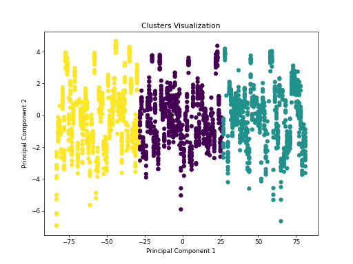

# Happiness Data Analysis

## Overview of the Data
The dataset `happiness.csv` contains information about various countries' happiness metrics from the year 2005 to 2023. This data is derived from a happiness survey which measures factors contributing to life satisfaction in different countries. The dataset includes several attributes related to well-being, including:

- `Life Ladder`: A quantitative measure of happiness.
- `Log GDP per capita`: The logarithm of the GDP per capita, serving as a proxy for economic well-being.
- `Social support`: A numerical value indicating the perceived support available from social networks.
- Other wellbeing indicators such as `Freedom to make life choices`, `Generosity`, `Perceptions of corruption`, `Positive affect`, and `Negative affect`.

### Dataframe Header
| Country name | year | Life Ladder | Log GDP per capita | ... |
|--------------|------|-------------|---------------------|-----|
| Afghanistan  | 2008 | 3.724       | 7.350               | ... |
| ...          | ...  | ...         | ...                 | ... |

### Summary Statistics
The dataset comprises 2363 entries with various statistical measures, including:
- Mean Life Ladder score: 5.48
- Mean Log GDP per capita: 9.40
- Outlier percentages for various factors, indicating the data distribution challenges.

## Description of the Analysis
### Preprocessing
The analysis began with loading the dataset and performing necessary preprocessing steps, such as handling missing values and outlier removal. The percentage of outliers in key variables was calculated to assess data quality.

### Principal Component Analysis (PCA)
PCA was performed to reduce the dimensionality of the dataset and to identify the most significant features that contribute to the variance in happiness scores. This technique helped to visualize and understand how different variables interact with one another.

### Clustering
A clustering algorithm (e.g., K-Means) was applied to group countries based on their happiness metrics. The appropriate number of clusters was determined using methods like the elbow criterion.

#### Cluster Visualization
The clustering results were visualized in a 2D plot:

### Correlation Analysis
A correlation matrix was created to examine the relationships between different attributes. The analysis indicated significant correlations, especially between `Life Ladder` and both `Log GDP per capita` and `Social support`.

## Key Insights

- **Economic Influence**: Higher GDP per capita strongly correlates with increased happiness (`Life Ladder`), indicating that economic factors are crucial to overall life satisfaction.

- **Social Support**: There is a strong connection between social support and happiness levels, underscoring the importance of community and relationships in mental well-being.

- **Freedom of Choice**: Increased perceived freedom to make personal life choices is positively associated with happiness, highlighting the role of autonomy in life satisfaction.

- **Negative Affect**: An interesting insight is the negative correlation between `Negative affect` and the `Life Ladder`, suggesting that higher levels of negative emotions are associated with lower happiness.

- **Perceptions of Corruption**: Higher perceptions of corruption correlate negatively with happiness levels, implying that trust in governance affects citizens' well-being.

In conclusion, the analysis of the happiness dataset reveals intricate relationships between economic, social, and psychological factors contributing to overall life satisfaction, underscoring the multifaceted nature of happiness across different nations. 

## Additional Information
For more detailed analysis, please refer to the provided visualizations and the summary statistics section specified above.