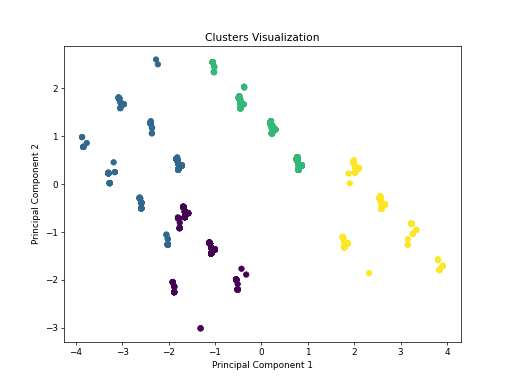

```markdown
# Media Analysis README

## Overview of the Data
The dataset consists of 2,652 entries of media content primarily categorized by `date`, `language`, `type`, `title`, `creator`, and ratings attributes such as `overall`, `quality`, and `repeatability`. The ratings are on a scale from 1 to 5, providing a quantitative assessment of media quality. The goal of this analysis is to uncover insights about this media, particularly characterizing clusters of titles and examining correlations between different ratings.

### Data Columns
- **date**: Release date of the media.
- **language**: Language in which the media is published (e.g., Tamil, Telugu).
- **type**: The type of media (e.g., movie).
- **title**: Title of the media.
- **by**: Primary creators of the media.
- **overall**: Overall rating out of 5.
- **quality**: Quality rating out of 5.
- **repeatability**: Value indicating if the media piece is worth watching again (1 - Yes, 2 - No, 3 - N/A).

### Summary Statistics
- **Overall Rating**: Mean = 3.05, Std = 0.76, Min = 1, Max = 5
- **Quality Rating**: Mean = 3.21, Std = 0.80, Min = 1, Max = 5
- **Repeatability**: Mean = 1.49 (indicating the majority find it repeatable).

### Outlier Analysis
Approximately **45.85%** of the `overall` ratings are classified as outliers, while only **0.90%** of `quality` ratings show similar significant deviation from normality.

## Analysis Performed

### Clustering and PCA
Clustering and Principal Component Analysis (PCA) were conducted to identify patterns based on the `overall`, `quality`, and `repeatability` ratings:
- Clustering produced distinct groups that allow us to see how media are classified based on their attributes.
- PCA reduced the dimensions of the dataset, retaining critical variance elements in fewer dimensions, making visualization and further analysis clearer.

A 2D representation of the clusters formed can be found below:



### Correlation Analysis
A correlation matrix was generated to understand the relationships between ratings:
- **Correlation between Overall and Quality**: 0.83 (indicating a strong positive relationship).
- **Correlation between Overall and Repeatability**: 0.51 (indicating a moderate positive correlation).
- **Correlation between Quality and Repeatability**: 0.31 (suggesting a weak correlation).

The heatmap visualizing these correlations can help identify associations among variables effectively.

## Key Insights
- **High Rating Correlation**: Higher overall ratings correspond strongly with higher quality ratings. Stakeholders might want to focus on the content that receives higher overall ratings, as they typically also score well in quality.
- **Repeatability**: With an average repeatability score of 1.49, most entries are rated as worth watching again, indicating a successful engagement strategy in media production.
- **Outlier Consideration**: A significant percentage of outliers in overall ratings indicates potential disparities in audience perception, suggesting further investigation into titles with especially high or low scores could provide actionable insights.
- **Statistical Testing**: Chi-square test results reveal significant associations between categories, especially between `type` and `language`, suggesting different genres or languages might engage audiences differently.

By leveraging these insights, media industry professionals can better tailor their content strategy to meet audience preferences and overall performance metrics.
``` 

**Note**: Make sure to have the image (`clusters_2d.png`) in the same directory as this `README.md` for the image to render correctly. Adjust image paths based on your project structure if needed.
